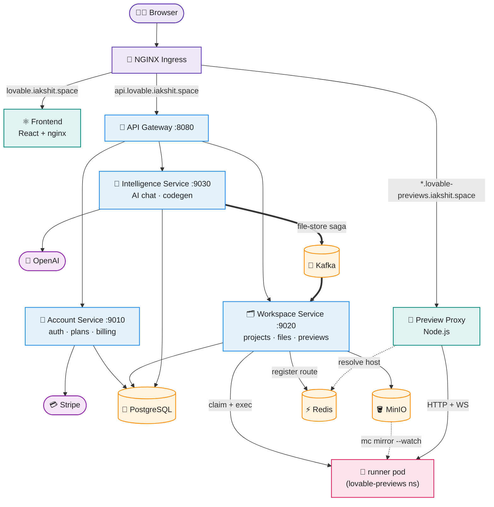

# Distributed Lovable Clone

A [Lovable](https://lovable.dev)-style AI app builder, built from scratch as a distributed system to learn Spring Cloud microservices, Kubernetes, and event-driven architecture properly instead of on toy examples.

You describe an app in chat, an LLM generates the code, and the project runs live in an isolated pod inside the cluster — with hot reload as the AI keeps editing files.

**Live:** [lovable.iakshit.space](http://lovable.iakshit.space) · **API:** [api.lovable.iakshit.space](http://api.lovable.iakshit.space)

## Architecture



Not shown to keep it readable: every Spring service pulls its config from `config-service` (:8888) at startup; Eureka (:8761) handles discovery in local dev, while in-cluster services resolve each other through Kubernetes DNS. The Feign calls between services (intelligence → workspace for files, intelligence/workspace → account for limits) are covered in the sections below.

## Tech stack


- **Backend:** Java 21, Spring Boot 4.1, Spring Cloud 2025.1.2 (Config, Eureka, Gateway/WebFlux, OpenFeign)
- **AI:** Spring AI 2.0 with OpenAI — streaming, tool calling, custom advisors
- **Data:** PostgreSQL (pgvector), Redis, Kafka, MinIO
- **Frontend:** React 19 + TypeScript, Vite, Nx, Tailwind, Redux Toolkit, Radix UI, assistant-ui
- **Infra:** Kubernetes (GKE), NGINX Ingress, Fabric8 Kubernetes client, Jib, GitHub Actions

## Services

| Service | Port | What it does |
|---|---|---|
| `config-service` | 8888 | Spring Cloud Config, backed by a [separate git repo](https://github.com/Akshityadav370/distributed-lovable-clone-config-server) |
| `discovery-service` | 8761 | Eureka registry (used locally; k8s uses cluster DNS instead) |
| `api-gateway` | 8080 | Reactive edge routing + JWT validation |
| `account-service` | 9010 | Users, auth, plans/subscriptions, Stripe billing |
| `workspace-service` | 9020 | Projects, members, file storage (MinIO), preview pod orchestration |
| `intelligence-service` | 9030 | LLM chat + code generation |
| `common-lib` | — | Shared security, DTOs, events, error handling (see below) |
| `frontend` | 4200 | Nx workspace, React app under `apps/web` |
| `k8s/proxy` | 80 | Small Node.js proxy that routes preview subdomains to pods |

Cross-service calls go over OpenFeign: workspace → account (project limits when creating a project), intelligence → workspace (file tree + contents) and → account (daily AI token limits).

### Auth & common-lib

Rather than terminating auth at the gateway, every service authenticates requests itself using shared pieces from `common-lib`:

- `JwtAuthFilter` extracts the Bearer token and populates the `SecurityContext` locally, so no service blindly trusts internal traffic
- a Feign interceptor grabs the caller's JWT and attaches it to outbound requests — when the intelligence service asks the workspace service for files, it does so *as the logged-in user*
- ownership checks are method-level: `@PreAuthorize("@security.canEditProject(#projectId)")`, backed by the project-members table
- shared DTOs, Kafka event records, and a global exception handler keep JPA entities from leaking across service boundaries

## How the AI code generation works

The interesting part is how the LLM gets project context and how generated files make it to storage without the intelligence service ever touching MinIO directly.

1. The user sends a chat message. It goes through the gateway to `intelligence-service`, which streams the response back over SSE.
2. Before the prompt reaches the LLM, a custom Spring AI advisor (`FileTreeContextAdvisor`) calls `workspace-service` over Feign, fetches the project's file tree, and injects it into the prompt as a system message. So the model always knows the current project structure.
3. The model also gets a `read_files` tool (`CodeGenerationTools`). When it wants to see actual file contents, it tool-calls with a list of paths — the tool call goes Feign → `workspace-service` → MinIO, and the contents come back into the model's context. The model only reads what it needs instead of getting the whole project dumped into the prompt.
4. Once the stream completes, `LlmResponseParser` splits the full response into chat events — thoughts, file edits, tool uses — by extracting the `<file>` / `<tool>` tags the system prompt asks the model to emit. Each `FILE_EDIT` becomes a saga: the intelligence service publishes a `FileStoreRequestEvent` to Kafka with a generated `sagaId`.
5. `workspace-service` consumes the event, checks the `sagaId` against a processed-events table (so redeliveries are idempotent), writes the file to MinIO under `projects/{projectId}/`, saves metadata to Postgres, and publishes an ACK back on a response topic.
6. The intelligence service consumes the ACK and marks the chat event confirmed or failed — which is what the frontend shows next to each file edit.

## How live previews work

Cold-starting a pod per preview would be slow, so there's a warm pool instead.

1. A `runner-pool` Deployment in the `lovable-previews` namespace keeps idle pods labeled `status=idle`. Each pod has two containers sharing an `emptyDir` volume:
   - `runner` — node:20-alpine, will run the Vite dev server
   - `syncer` — `minio/mc`, connected to the in-cluster MinIO
2. When a user opens a preview, `workspace-service` (via the Fabric8 client) first checks if a running pod is already labeled with that `project-id` — if so, it just re-registers the route and returns.
3. Otherwise it claims an idle pod by patching its labels to `status=busy, project-id=<id>`. Because the label no longer matches the Deployment selector, the Deployment spins up a fresh idle replacement — the pool refills itself.
4. It then execs into the containers:
   - syncer: `mc mirror myminio/projects/<id>/ /app/` to pull the project files, then a second `mc mirror --watch` in the background so any files the AI writes later keep syncing in
   - runner: `npm install && npm run dev` (Vite on 5173)
5. Once port 5173 accepts connections, it writes a route to Redis: `route:project-<id>.lovable-previews.iakshit.space → <podIP>:5173`, with a 6h TTL.
6. All `*.lovable-previews.iakshit.space` traffic hits the Node.js proxy (via the wildcard ingress rule). The proxy looks up the hostname in Redis and forwards the request — including WebSocket upgrades, so Vite HMR works.

Net effect: the AI writes a file → Kafka → MinIO → `mc --watch` mirrors it into the pod → Vite hot-reloads → the user sees the change in the preview, live. NetworkPolicies keep the preview namespace isolated from core services, since the pods run untrusted generated code.

## Running locally

You need Java 21, Node 20+, and Docker.

**1. Backing stores** (only the business services need these):

```bash
docker run -d --name pg    -p 5432:5432 -e POSTGRES_PASSWORD=postgres pgvector/pgvector:pg16
docker run -d --name redis -p 6379:6379 redis:7
docker run -d --name kafka -p 9092:9092 apache/kafka:3.9.0
docker run -d --name minio -p 9000:9000 -p 9001:9001 \
  -e MINIO_ROOT_USER=minio -e MINIO_ROOT_PASSWORD=minio123 \
  quay.io/minio/minio server /data --console-address ":9001"
```

**2. Services**, in order (each in its own terminal):

```bash
cd config-service && ./mvnw spring-boot:run        # :8888 — start this first, everything pulls config from it
cd discovery-service && ./mvnw spring-boot:run     # :8761 — Eureka dashboard

cd common-lib && ./mvnw clean install              # one-time, shared by the services below

cd api-gateway && ./mvnw spring-boot:run
cd account-service && ./mvnw spring-boot:run
cd workspace-service && ./mvnw spring-boot:run
cd intelligence-service && ./mvnw spring-boot:run  # needs AI_API_KEY set
```

**3. Frontend:**

```bash
cd frontend
npm install
npx nx serve web
```

Per-service config (DB URLs, Kafka/Redis/MinIO settings, secrets) lives in the external [config repo](https://github.com/Akshityadav370/distributed-lovable-clone-config-server) and is served by `config-service` at startup. If a service fails to boot complaining about a missing property, look there.

## Deploying to Kubernetes

Assumes a cluster with the NGINX Ingress Controller, and DNS for `lovable.iakshit.space`, `api.lovable.iakshit.space`, and `*.lovable-previews.iakshit.space` pointing at it.

```bash
# 1. Namespaces (lovable-core, lovable-previews) + shared ConfigMap
kubectl apply -f k8s/infra/namespaces.yaml

# 2. Secrets — everything reads from one 'app-secrets' Secret
kubectl create secret generic app-secrets -n lovable-core \
  --from-literal=JWT_SECRET=... \
  --from-literal=GIT_USERNAME=... \
  --from-literal=GIT_PASSWORD=... \
  --from-literal=POSTGRES_PASSWORD=... \
  --from-literal=ACCOUNT_DB_PASSWORD=... \
  --from-literal=WORKSPACE_DB_PASSWORD=... \
  --from-literal=INTELLIGENCE_DB_PASSWORD=... \
  --from-literal=MINIO_ROOT_USER=... \
  --from-literal=MINIO_ROOT_PASSWORD=... \
  --from-literal=AI_API_KEY=... \
  --from-literal=STRIPE_API_KEY=... \
  --from-literal=STRIPE_WEBHOOK_SECRET=...

# 3. Stateful infra: pgvector, Redis, Kafka, MinIO
kubectl apply -f k8s/stateful/

# 4. App services — config-service first, everything bootstraps from it
kubectl apply -f k8s/services/config-service.yaml
kubectl apply -f k8s/services/

# 5. Preview proxy, runner pool, network policies, ingress
kubectl apply -f k8s/proxy/proxy-deployment.yaml
kubectl apply -f k8s/infra/runner-pool.yaml
kubectl apply -f k8s/infra/core-network-policies.yaml
kubectl apply -f k8s/infra/preview-network-policies.yaml
kubectl apply -f k8s/infra/ingress.yaml
```

In-cluster, services run with `SPRING_PROFILES_ACTIVE=k8s`: Eureka is disabled and everything resolves through cluster DNS.

## CI/CD

Each service has its own GitHub Actions workflow in `.github/workflows/`, path-filtered so a push to `main` only rebuilds the service that changed. Each pipeline:

1. Builds and installs `common-lib` first (the services depend on it)
2. Builds the service image with Jib — no Dockerfile — tagged with the git commit SHA plus `latest`, and pushes to Docker Hub
3. Authenticates to Google Cloud via **Workload Identity Federation** (OIDC trust between the GitHub repo and a GCP service account — no JSON keys stored anywhere)
4. Rolls the deployment with `kubectl set image ... :$GITHUB_SHA` and waits on `kubectl rollout status`, so deploys are zero-downtime and every image is traceable to a commit
